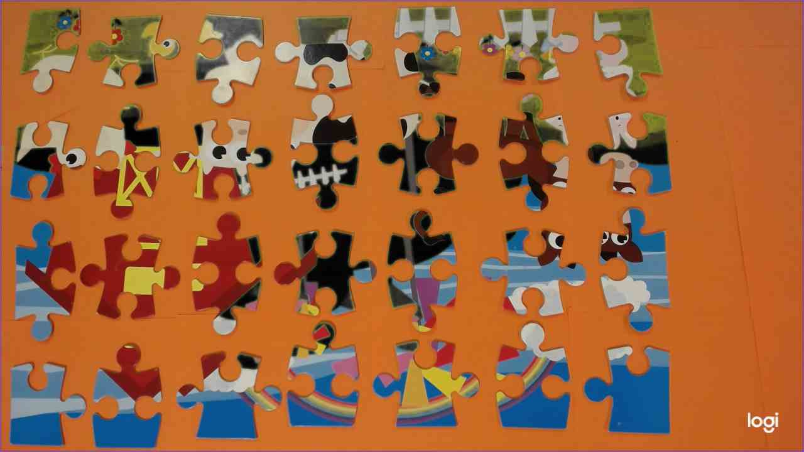

# Partie analyse : Identification pièces de puzzle

## Contributeurs

- p2006010 - [Boulet Benjamin]

## Demarches utilisées

### 1. Création du masque binaire

- on applique un filtre median pour réduire le bruit et applatir les couleurs

- On convertit l'image en LAB pour pouvoir séparer les couleursa

- On calcul grâce à des histogrammes la valeur dominante de chaque canal donc L A et B

- Sur, l'image flouté, on regarde si la valeurs de chaque pixel est proche de la valeur dominante de chaque canal. Si c'est le cas, on colorie le pixel en noir sinon en blanc

- On applique ensuite plusieurs fermeture avec **`cv2.morphologyEx(image,cv2.MORPH_CLOSE, noyau)`**  
   et ouvertures avec  
   **`cv2.morphologyEx(image, cv2.MORPH_OPEN, noyau)`**  
   pour supprimer les petits trous et les petits points blancs

### 2. Détection des contours => Identification des pièces

- On utilise la fonction **`c2v.findContours(image, ...)`** pour trouver les contours de sur le masque binaire

- on les trie par odre croissant de haut gauche à bas droite ( afin de nous faciliter la tache pour la suite )

### 3. Extraction des pièces

#### Extraction des masques :

- on créer un maque vide de la taille de du masque binaire

- pour chaque pièce, indépendement des autres, on dessine le contour de la pièce sur le masque vide et on fait un **`bitwise_and(masque binaire, masque binaire, mask=notre masque précendent)`** ( ET ) avec le masque binaire pour ne garder que le masque de la pièce.

- On rogne ensuite avec le boundingRect du contour de la pièce pour extraire juste le masque de la pièce ( rogné )

---

#### Extraction des pièces :

- On prend le masque de la pièce trouvé précedemment et on fait un **`bitwise_and(image de base, image de base, mask=masque trouvé précedemment)`** ( ET ) avec l'image de base

- De même, on rogne avec le boundingRect du contour de la pièce pour extraire juste la pièce ( rogné ).

---

#### On enregistre les images donnée dans leur dossier réspéctif :

- **Mask/** , avec **`wideMask/`** pour les grands masques et **`cutMask/`** pour les masques rognés

- **images/**, avec pareil, **`widePieces/`** et **`cutPieces/`**

#### Après toute ces étapes, on arrive à afficher la pièce coupé, son masque, ses contours :

---

### 4. Identification des contours

- On simplifie les contours de la pièce avec **`cv2.approxPolyDP(contour, epsilon, true)`** avec :

  - **contour** : le tableau de contours de la pièce.
  - **epsilon** : paramètre spécifiant la précision de l'approximation.
  - **true** : indique que le polygone approximé doit être fermé. ( polygone fermé ).

- On trace des lignes horizontal et vertical sur chaques bords de la pièce. cad. :

  - **Vertical 1 :** Point 1:{18, 0} à Point 2:{18, Hauteur}
  - **Vertical 2 :** P1:{Longeur - 23, 0 } à P2:{Longeur - 23, Hauteur}
  - **Horizontal 1 :** P1:{0 ; 23} à P2:{Longeur ; 23}
  - **Horizontal 2 :** P1:{0 ; Hauteur - 23} à P2:{Longeur ; Hauteur - 23}

- On parcours ensuite chaque lignes et on compte les points de contact avec les contours grâce à la fonction **`count_line_contact(ligne, contours, image de base)`**
  - **ligne** : la ligne qu'ont étudie.
  - **contours** : le tableau de contours
  - **image..** : image ( pour pouvoir dessiner les points de contact, en rouge )

2 resultats pour une ligne :

- Il y a 4 point de contacts. C'est qu'il y'a un trou !

- Il y'a 2 point de contact. C'est qu'il y'a soit une protubérence soit que c'est le corps de la pièce.  
  Pour les différencier, on calcul la distance entre les 2 points :

  - Si la distance est inférieur à 60 ( arbitraire ), c'est une protubérence. Sinon c'est le corps de la pièce.

- Dans les 2 cas, on calcul la moyenne des points pour trouver le centre de la protubérence ou du trou et on affiche un P ou un T sur ce centre.

#### On applique cette methode sur toutes les pièces et on enregistre le tout dans `image/infoPieces`

 

---
